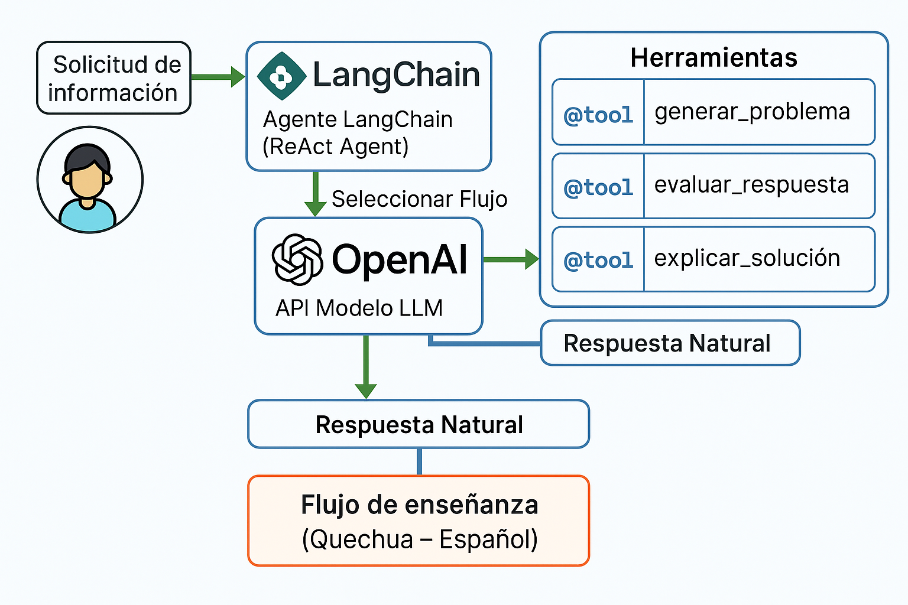

# 🧠 Agente Educativo Bilingüe con LangChain - MemoriaAplicadalangChain

## 🎯 Objetivo General

Diseñar y construir un agente inteligente especializado, capaz de:

- 🛠️ Utilizar múltiples herramientas personalizadas en LangChain.
- 🤖 Ejecutar tareas educativas de forma autónoma y eficiente.
- 💻 Ser funcional desde un entorno programático como Google Colab.
- 🌐 Incluir opcionalmente una interfaz web (ej. Gradio o Streamlit).

---

## 1. Diagrama de arquitectura

El sistema permite que un niño interactúe con el agente mediante lenguaje natural para aprender matemáticas básicas. El agente puede:

- Generar un problema de suma o resta.
- Evaluar la respuesta dada por el niño.
- Explicar la solución paso a paso.

Todo el flujo se realiza mediante un **agente ReAct** de LangChain usando herramientas personalizadas y memoria contextual.



---

## 2. Descripción de herramientas y funciones

### 2.1 generar_problema()
Genera un problema de suma o resta simple en quechua con apoyo en español. Elige números pequeños (1-10) para facilitar el aprendizaje.

### 2.2 evaluar_respuesta(respuesta_usuario: int)
Evalúa si la respuesta del niño es correcta comparándola con la solución del problema. Devuelve "correcta" o "incorrecta".

### 2.3 explicar_solucion()
Explica paso a paso cómo resolver el problema en caso de error, también en quechua y español, fomentando el aprendizaje guiado.

---

## 3. Flujo de funcionamiento (Tool Invocation)

El agente utiliza el modelo **ReAct (Razonamiento + Acción)** y sigue este flujo:

**a) generar_problema()**  
- Genera un problema matemático como: "¿Imayna qanchis ñiqin ñawpaq chayuqmi hoqniyuq chayuqmi kachkan? (7 + 1)"

**b) evaluar_respuesta(respuesta)**  
- Recibe la respuesta del niño.
- Compara contra la respuesta correcta y determina si es válida.

**c) explicar_solucion()**  
- Si el niño falla, proporciona una explicación didáctica paso a paso del ejercicio.

---

## 4. Instrucciones de ejecución

### 4.1 Ejecutar en Google Colab o localmente

1. Clonar este repositorio o abrir el archivo `MemoriaAplicadalangchain.ipynb`.
2. Instalar las dependencias:

```bash
pip install langchain langchain-openai openai
```

3. Crear una API Key de OpenAI:
   - [https://platform.openai.com/account/api-keys](https://platform.openai.com/account/api-keys)
   - Guardarla como variable de entorno o directamente en el código.

4. Ejecutar el agente desde el notebook:
   - Interactuar con el niño mediante inputs de texto.
   - El agente selecciona la herramienta y responde automáticamente.

---

## 5. Reflexión técnica

Este proyecto demuestra cómo **LangChain**, combinado con herramientas personalizadas y memoria conversacional, puede adaptarse al ámbito educativo e intercultural. El uso de idioma quechua promueve una inclusión real en tecnologías emergentes para primeras infancias.

---
